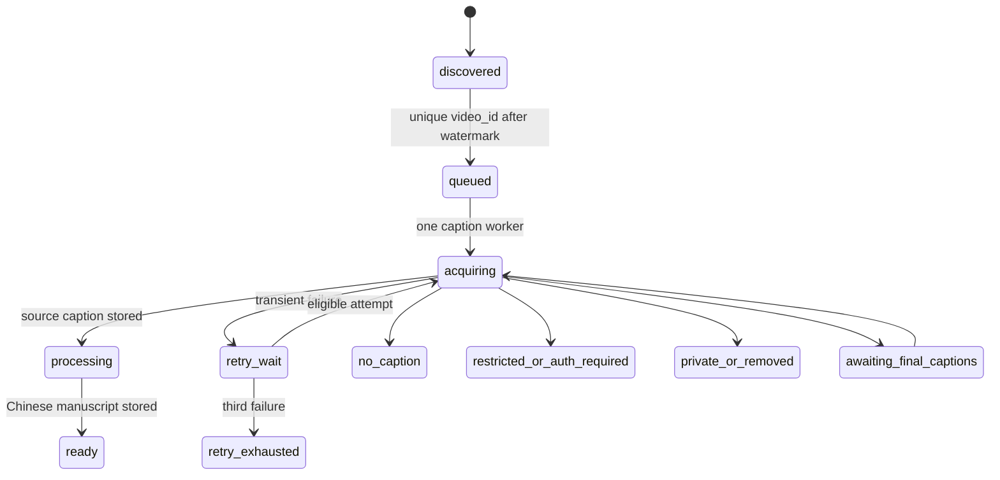

# Batch acquisition safety envelope

**Decision researched:** how the first local desktop release can prepare a faithful Simplified-Chinese reading manuscript for every newly discovered subscription update without treating YouTube as an unlimited batch API.

## Decision

Use Google OAuth **only** to import the user's subscription list, then discover updates from each public channel's Atom feed.  A local, durable queue processes every newly discovered video. It acquires one existing caption track through `yt-dlp`, translates and restructures that source into the manuscript, then leaves the result for manual review. There is deliberately no AI relevance ranking in this release.

This is a best-effort preparation pipeline, not a guarantee that every video can yield a manuscript: a private, restricted, removed, or captionless video must remain visible as an unavailable item. Generating a purportedly faithful manuscript without an accessible source transcript would violate the product's stated fidelity boundary.

Do **not** use `captions.download` for videos from subscribed third-party channels. Google's API says that endpoint requires permission to edit the video and costs 200 quota units per call. It cannot be the normal reader path. The earlier Vegapunk investigation reached the same conclusion for its `captions.list`/`captions.download` implementation, whose fallback also depended on undocumented web endpoints.

## Operating defaults

| Concern | First-release default | Why this is the boundary |
| --- | --- | --- |
| Subscription import | Run `subscriptions.list(mine=true)` at account connection and on an explicit refresh only. Persist channel IDs and do not infer subscriptions from a page scrape. | `mine=true` requires an authorized request; `subscriptions.list` costs one unit per page. It is a low-volume account operation, distinct from regular update discovery. |
| Update discovery | Poll every imported public channel's Atom feed on launch and then every **6 hours while the app is running**. Coalesce manual refreshes into the active run; allow no more than one manual run per **15 minutes**. A closed desktop app makes no promise of background delivery. | RSS/Atom is the selected public discovery source and needs no Data API caption calls. Its rate envelope is undocumented, so serial, coalesced scans are safer than bursty fan-out. Six hours bounds ordinary staleness without turning a local app into a poller. |
| First connection | Establish a watermark and process **no historical videos by default**. Offer an explicit, separately confirmed backfill of the most recent **7 days, capped at 100 videos total**; it uses the same queue and can be paused. | A user with many subscriptions must not receive an unbounded surprise bill or a large initial burst. From the watermark onward, every newly discovered update enters the queue. |
| Discovery concurrency | One scan at a time; fetch feeds serially with a 1-second request gap and small random jitter. Persist the last successful feed scan per channel. | Prevents duplicate scan bursts and makes partial failures recoverable. A channel failure does not block other channels. |
| Caption concurrency | **One `yt-dlp` caption job at a time**, with at least a 2-second gap before the next job. Generation is a separate queue with **one** active manuscript job. | The existing CLI probes metadata and then downloads a selected subtitle track, so one item already entails multiple upstream requests. Serial caption work produces an understandable, conservative load and keeps LLM spending observable. |
| Caption source | For a video, use the one best accessible source track: user-selected language if present; otherwise a human-authored Chinese track; then a human-authored original-language track; then an auto-generated original-language track. Store its language, human/auto provenance, raw timed text, retrieval time, and checksum. Translate the acquired source to Simplified Chinese and label auto-generated provenance. | `yt-dlp` supports selecting subtitle languages and separate human/automatic subtitle writes. Existing StrataRead code already probes available tracks and selects one before downloading. Keeping raw timed text makes the manuscript reviewable. |
| Caption fallback | Retry the same `yt-dlp` path with a user-configured browser-cookie session when anonymous access reports authentication/bot gating. Do not automatically rotate proxies, scrape an undocumented transcript API, download media for ASR, or call the official caption download endpoint for third-party videos. | `yt-dlp` documents browser-cookie extraction. The official caption endpoint's edit-permission rule rules it out; automatic evasion mechanisms turn a normal transient failure into a policy and account-risk problem. ASR is a future product decision, not an implicit substitute for captions. |
| Retry | At most **three total caption attempts** per video: initial, then after 15 minutes, then after 6 hours (with jitter). Retry only timeout, connection, 5xx, and explicitly transient 429 failures. A 429 pauses the entire caption queue for at least 6 hours. | Bounded retry prevents a bad item from being retried on every scan. `yt-dlp` exposes retry and sleep controls, but application-level limits are needed so its defaults cannot silently create an open-ended batch. |
| Permanent/degraded states | `no_caption`, `private_or_removed`, `restricted_or_auth_required`, `unsupported`, and `retry_exhausted` are terminal until a user explicitly retries or changes credentials. A live stream that has not finished becomes `awaiting_final_captions` and is retried once 24 hours after its end. | These states preserve the update in the user's inbox while accurately saying why no reading manuscript exists. They avoid treating an unavailable source as an empty or fabricated document. |
| Idempotency | The canonical key is YouTube `video_id`, globally unique in local storage. The queue has one active job per ID. A completed manuscript is not regenerated unless its raw-caption checksum or manuscript recipe version changes. | RSS entries repeat across scans; durable uniqueness and a source checksum make restarts, overlapping runs, and title edits harmless. |
| Cost and volume ledger | Every run records channels due/succeeded/failed, feeds fetched, new videos, duplicates, state counts, attempts, queue depth, and next eligible retry. It separately records Data API units used for subscription import, caption-request count, source duration/characters, LLM input/output tokens, configured estimated LLM cost, and actual provider cost when available. | Google counts even invalid Data API calls and each page separately; LLM costs are the material variable once every update is processed. Explicit accounting prevents a background queue from becoming invisible spending. |

## What the UI must reveal

The inbox must show all discovered updates, including those without a manuscript. Each non-ready item exposes its state, plain-language cause, last attempted time, next retry (if any), and a safe user action: retry now, update browser-cookie access, or open the original video. It must never silently omit an item because caption preparation failed.

The sync view must show the last completed scan, current phase and queue depth, per-run totals, failures grouped by cause, the active cooldown, and estimated versus actual model cost. It also must say that discovery runs only while the local app is open and show the coverage watermark / last successful scan per channel. This makes the boundary legible: the app prepares every *discovered, accessible* update, while surfacing the exceptions for human judgment.

## State model

## Evidence and limits

- [Google: `subscriptions.list`](https://developers.google.com/youtube/v3/docs/subscriptions/list) documents `mine=true` as an authorized request and gives the method a one-unit quota cost.
- [Google: quota calculator](https://developers.google.com/youtube/v3/determine_quota_cost) states that every request, including invalid ones, costs at least one unit; pages cost separately; the default combined daily allocation for other endpoints is 10,000 units. It lists `captions.list` at 50 units.
- [Google: `captions.download`](https://developers.google.com/youtube/v3/docs/captions/download) sets its cost at 200 units and requires permission to edit the video. Therefore OAuth subscription import does not authorize caption downloading for subscriptions.
- [yt-dlp README: subtitle options](https://github.com/yt-dlp/yt-dlp#subtitle-options) documents separate human and automatic subtitle switches and language selection; [network options](https://github.com/yt-dlp/yt-dlp#network-options) documents request/subtitle sleeps and retries; [cookies from browser](https://github.com/yt-dlp/yt-dlp#authentication-options) documents local browser-cookie extraction.
- [Vegapunk's prior request-risk audit](https://github.com/v6582374-netizen/Vegapunk/blob/c9b41d843f5a6d302bd988aff082d00c4d943e04/docs/research/2026-08-20-youtube-fetch-updates-request-risk.md) records the same third-party-caption permission problem and the IP/maintenance risk of its undocumented fallback. Its exact scoped implementation is [the YouTube service](https://github.com/v6582374-netizen/Vegapunk/blob/c9b41d843f5a6d302bd988aff082d00c4d943e04/desktop/openworker/upstream/coworker/youtube/service.py).

The Atom feed endpoint has no published request-rate contract in these authoritative sources. The six-hour interval, serial scan, request spacing, and backfill cap are therefore conservative product defaults, not vendor-guaranteed limits. They should remain configurable only after telemetry demonstrates need; no automatic proxy rotation or limit bypass belongs in the product.
