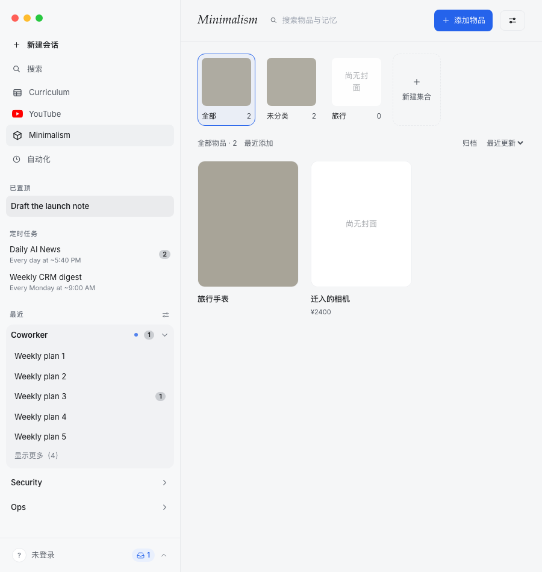
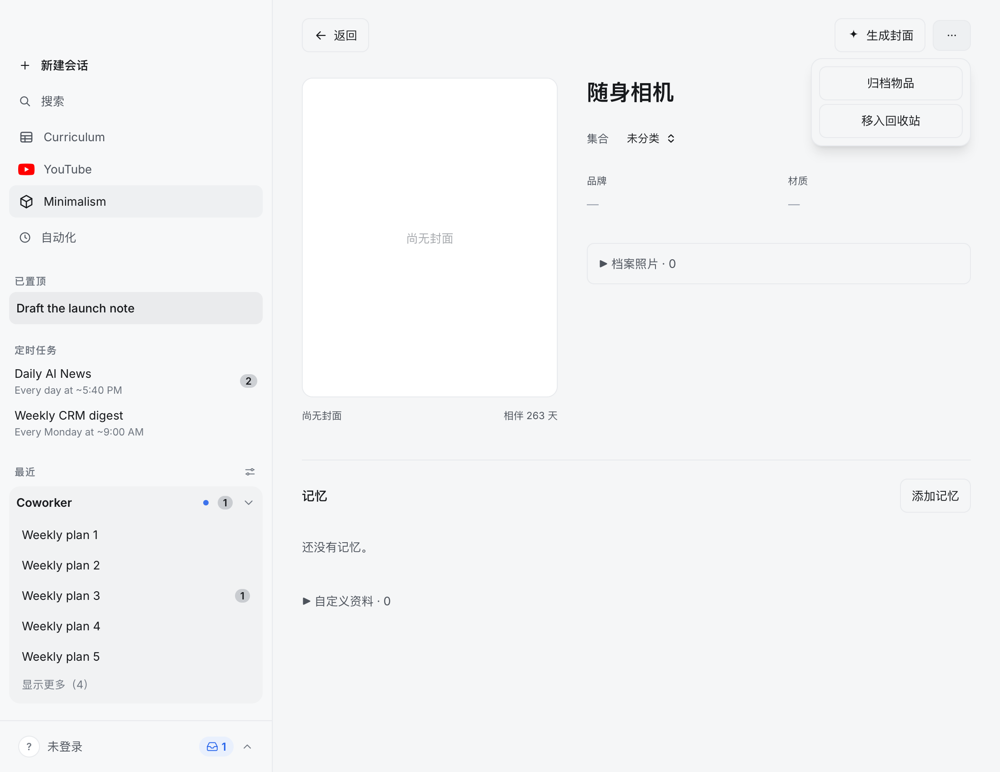

# Edison 精修审查 · 2026-09-21

产品应该给人安静、直接、可掌控的感觉。当前配色、留白和编辑式标题已经有自己的性格；下一轮最有价值的工作是统一交互边界与反馈，再补少量状态过渡。

本轮为 `find-animation-opportunities` + `apple-design` 只读审查，未修改产品源码。以下为待实施方案，不代表已修复。

## 先于动效的两个问题

### 1. 弹窗的边界需要真实成立

**已在 Chromium 与 WebKit 复现：**打开 Minimalism → 添加物品 → 将焦点移到“保存” → Tab，焦点离开弹窗落到 body；此时按 Esc，弹窗仍在。

位置：[MinimalismView.tsx:747](../../surfaces/gui/src/components/MinimalismView.tsx#L747)。照片/封面预览的另一套弹窗位于 [ObjectDossier.tsx:548](../../surfaces/gui/src/components/minimalism/ObjectDossier.tsx#L548)，本轮仅静态核对该处，不能将它也视为已经复现。

验收标准：Tab 与 Shift+Tab 在可用控件间闭环；Esc 始终关闭最上层弹窗；关闭后回到原触发器；背景不能得到焦点。YouTube 的 [Dialog.tsx:25](../../surfaces/gui/src/components/youtube/Dialog.tsx#L25) 已有焦点保存与循环处理，优先复用、补齐同一套行为，避免再造弹窗管理层。动画不得延迟焦点管理。

### 2. 小缩略图不要照搬大图的占位排版

**已在截图确认：**集合缩略图里的“尚无封面”断成“尚无封 / 面”。[ObjectImage.tsx:57](../../surfaces/gui/src/components/minimalism/ObjectImage.tsx#L57) 对所有图片尺寸都用相同的左右内边距；集合调用点为 [MinimalismView.tsx:520](../../surfaces/gui/src/components/MinimalismView.tsx#L520)。

建议小缩略图移除这句重复提示，以居中的 16px 图片图标表达空封面，集合名称继续放在下方；大图保留文字。这样既消除断行，也减少视觉噪声。非交互占位无需动效。

## 1. 保留的动效机会

频率是基于使用路径的估计，并非埋点统计。以下全部只用于指针触发；键盘打开、关闭、激活保持即时。只有异步结果本身的呈现才不依赖输入方式。

沿用 [progress.css:4](../../surfaces/gui/src/components/youtube/progress.css#L4) 已有的 `--ease-out: cubic-bezier(.23, 1, .32, 1)`。它目前只在 `.yp-progress` 内定义：实施时将同一值提升为共享 token，不能假定其他弹窗已经能继承。反向关闭曲线取数学镜像 `cubic-bezier(.68, 0, .77, 0)`，是由现有曲线推导出的新增 token，非当前已有定义。不引入 Motion/Framer Motion。

| # | 位置 | 现在 | 目的 | 频率 | 建议动效 | 功能与预算门槛 |
| --- | --- | --- | --- | --- | --- | --- |
| 1 | [Dialog.tsx:61](../../surfaces/gui/src/components/youtube/Dialog.tsx#L61)、[MinimalismView.tsx:747](../../surfaces/gui/src/components/MinimalismView.tsx#L747) | 指针打开时表面直接出现；条件卸载直接消失 | Preventing a jarring change，避免突变 | 偶尔；订阅设置、新建表单 | 表面 `scale(.98) → scale(1)`、`opacity:0 → 1`，中心原点，200ms `cubic-bezier(.23,1,.32,1)`；遮罩仅 opacity 同步。关闭沿原路径反向，200ms `cubic-bezier(.68,0,.77,0)`。减少动态时仅 opacity，100ms 同方向曲线 | 只动浮层，不移动背景或正文；不等待动画才响应。200ms 在弹窗预算内 |
| 2 | [minimalism/types.ts:78](../../surfaces/gui/src/components/minimalism/types.ts#L78) | “添加物品”按下时，背景、透明度、位置均不变；共享按钮样式未提供按下态 | Feedback，即时反馈 | 每天数十次；限定添加、保存等明确操作按钮 | pointer-down 即开始 `scale(1) → scale(.98)`，100ms `cubic-bezier(.23,1,.32,1)`；释放、取消回到 1，用同样100ms曲线。减少动态时固定尺寸，改 `opacity:1 → .88 → 1`，100ms 同曲线 | 反馈与业务提交分离，提交仍在 click；只动视觉内容，点击区域固定。100ms符合预算；禁用状态不响应 |
| 3 | [ObjectDossier.tsx:157](../../surfaces/gui/src/components/minimalism/ObjectDossier.tsx#L157)、[MinimalismView.tsx:561](../../surfaces/gui/src/components/MinimalismView.tsx#L561) | “物品操作 / 管理集合”菜单直接出现，视觉上像另一张卡片 | Spatial consistency，空间连续性 | 偶尔；管理操作 | 从右上触发器展开：`transform-origin: top right`，`scale(.97) → 1`、`opacity:0 → 1`，160ms `cubic-bezier(.23,1,.32,1)`；关闭沿原路径，160ms `cubic-bezier(.68,0,.77,0)`。减少动态仅 opacity 100ms 对应曲线 | 小表面且不挤动周围布局；菜单出现即能操作。160ms在菜单预算内 |

所有行只动画 `transform` 与 `opacity`。不新增 hover 动效；若后续调整 hover 外观，限定 `@media (hover: hover) and (pointer: fine)`。CSS transition 需从当前显示值重新定向，快速按下/释放与关闭/重开不能闪回初始状态。退出呈现与逻辑关闭分离，不可用延迟提交或锁定输入来换流畅；键盘 Esc 无动画延迟。原生 details 若无法可靠实现可打断的退出，应复用已有浮层开闭行为，不能叠加定时器补丁。

菜单的视觉减法：保留外层表面、边界与阴影，内部操作使用普通菜单行，去掉每行独立的按钮边框。当前“浮层里面再放两张卡片”的感觉，比缺少弹簧更明显。

## 2. 明确拒绝的候选

- [SearchModal.tsx:18](../../surfaces/gui/src/components/SearchModal.tsx#L18)：搜索、方向键选择、快捷键跳转。**频率门槛拒绝：键盘驱动的高频操作，保持即时。**
- [App.tsx:1765](../../surfaces/gui/src/App.tsx#L1765) 及 YouTube 的阅读布局切换：整页滑入、页面交叉淡出。**频率门槛拒绝：核心导航不应让人等待。**物品档案也不做整页共享元素飞行动画。
- [MinimalismView.tsx:650](../../surfaces/gui/src/components/MinimalismView.tsx#L650)：画廊卡片逐个入场。**功能门槛拒绝：搜索、筛选与返回后的可读内容不应轮流出现。**
- [ObjectDossier.tsx:420](../../surfaces/gui/src/components/minimalism/ObjectDossier.tsx#L420)：添加记忆时周围正文弹跳、折叠区推挤。**功能门槛拒绝：编辑文本时稳定的位置比装饰运动重要。**
- [MinimalismView.tsx:658](../../surfaces/gui/src/components/MinimalismView.tsx#L658)：拖入集合后的惯性甩动。**目的门槛拒绝：当前是原生拖放分类，并没有可自由放置、需要投射动量的物理对象。**不为动画另造手势系统。

## 3. 判断与交接

Edison 需要很少的新运动。静态视觉已接近方向，交互闭环仍有明显缺口。先修弹窗焦点和空封面排版，再统一弹窗过渡，最后补按钮与菜单；其中弹窗行为与过渡的统一收益最大。交接入口：`improve-animations plan 统一 Edison 的低频弹窗过渡；保持键盘操作即时、可打断，并先补齐 Minimalism 焦点边界`。

## Apple Design 对静态精度的约束

- 保留已有编辑式标题的产品性格，不为了模仿系统设置而统一抹掉。正文与表单继续使用清晰的无衬线层级；不要给所有字号统一负字距。
- 弹窗是独立任务，用遮罩隔离；菜单是局部操作，只用表面与轻阴影分层。不要新增全屏背景缩放或多层玻璃。
- 沿用共享 `--panel`、`--line`、`--scrim`，收敛两个模块的表面差异；针对 `prefers-reduced-transparency` 保持实色后备，`prefers-contrast: more` 加强边界。这里不增加 blur 动画。
- 先统一真实交互含义，再统一像素。主按钮的颜色、标题风格若要跨模块收敛，应单独做视觉对比；本轮证据不足以认定所有差异都是问题。

## 审查覆盖与证据边界

入口为 `surfaces/gui`，旧 `desktop` 不在本次范围。主查 YouTube、Minimalism，宿主导航/搜索作为排除项；不是对全部集成、设置、聊天工具卡的穷尽审计。

React 18 + Tailwind + 普通 CSS；package.json 未声明专用 motion 库。检查了按下反馈、条件浮层、菜单原点、列表/群组入场、折叠内容、拖放、空态和完成态。保留前三类机会；列表、折叠、原生拖放经门槛排除；空态先修排版；保存 dirty 按钮来自键盘编辑，因此不建议动效。通知已有入场动画，本技能不将现有动画的修订列为新增机会。

验证：

- 现有6条 Chromium E2E 通过：YouTube 800/1100/1440px 共享视图与设置，Minimalism 900/1440px 真实临时资料库生命周期，英文进度阶段800–1360px布局。
- 额外只读审查脚本在 Chromium 与 WebKit 各完成一次：测量按下前后状态、弹窗/菜单样式，复现 Tab 逸出与随后的 Esc 失效，采集明暗截图。脚本完成不代表问题已修复。
- 前两个临时审查尝试因定位器歧义及不完整的模拟集合数据未完成；修正审查夹具后再验证，不计作产品失败。
- `runtime.json` 为最后一次 WebKit 采集。弹窗与菜单截图为 WebKit；画廊和文档库总览截图为 Chromium。WebKit 浏览器验证不等同于打包后的 Tauri 原生窗口验收。
- 当前只确认了现状，不声称建议动画已经过逐帧或真机手感验证。实施时必须检查快速反向、减少动态、键盘即时响应和焦点恢复。

发现路径优先查询已提供的 code-review-graph MCP。项目 Edison，图索引更新时间 2026-09-21T11:49:39，构建 SHA `756cb47fb8042c9054d678e46b77be0ce9b48283` 与 HEAD 一致，但工作区有现有未提交变更。当前会话未提供 codebase-memory 的 `check_index_coverage`/`get_code_snippet` 工具，不能宣称完成图覆盖认证；图仅用于定位，所有实质结论回到当前源码/CSS及运行界面核对。未修改这些现有变更。

复现材料：[审查脚本](audit.spec.ts.txt)、[WebKit 配置](webkit.config.ts.txt)、[运行数据](runtime.json)。将脚本临时复制回 `surfaces/gui/e2e/polish-audit-temp.spec.ts`，配置复制回 `surfaces/gui/playwright.polish-temp.config.ts`，在 GUI 目录运行 `npx playwright test -c playwright.polish-temp.config.ts`。测试通过 fixtures 隔离真实账户数据；审查结束删除临时文件。
